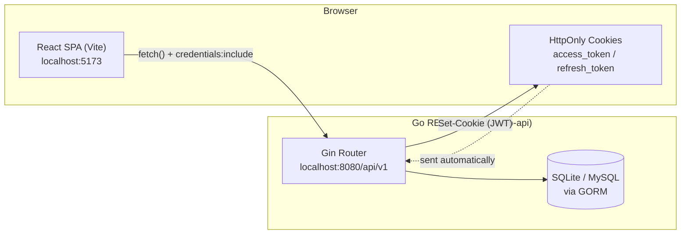
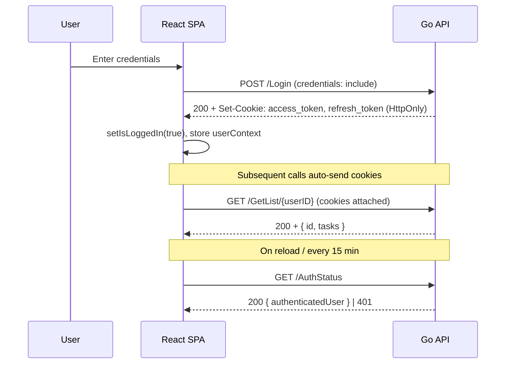
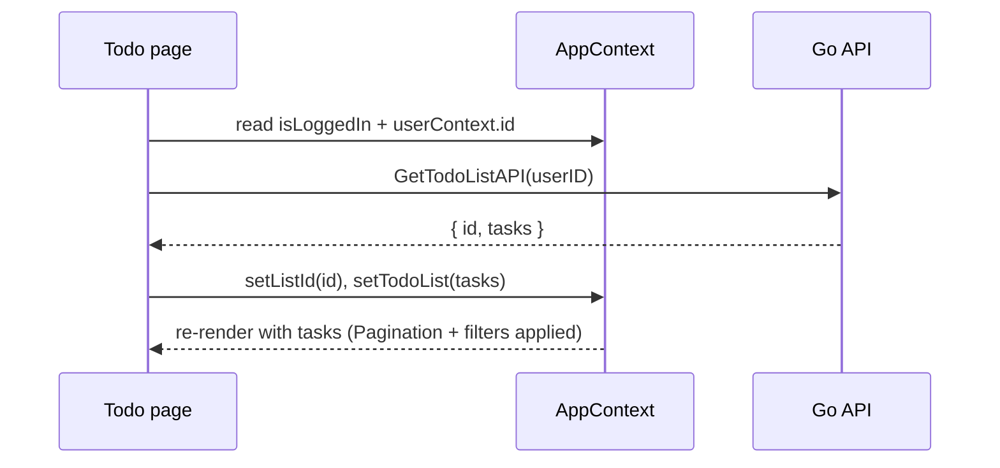

# Todo App — React Frontend

A single-page Todo application built with **React 19** and **Vite**. It is the client tier of a two-service system: this SPA talks to a separate **Go (Gin) REST API** ([todo-web-api](https://github.com/YawDev/todo-web-api)) that handles authentication, persistence, and business logic.

Users register, log in, and manage a personal todo list (one list per user) with create / edit / complete / delete operations, pagination, and filtering. Authentication is cookie-based (HttpOnly JWT access + refresh tokens issued by the backend).

---

## Tech Stack

| Concern | Choice |
| --- | --- |
| UI library | React 19 |
| Build tool / dev server | Vite 6 |
| Routing | React Router DOM 7 |
| Styling | Tailwind CSS 4, Bootstrap 5 / React-Bootstrap, custom CSS |
| Icons | Heroicons, react-icons, react-bootstrap-icons |
| Animation | Framer Motion |
| Loaders | react-spinners |
| State sharing | React Context (`AppContext`) |
| HTTP | native `fetch` (with `credentials: "include"`) |

---

## System Architecture

This frontend is purely a presentation/client layer. All state that matters is owned by the backend; the SPA holds only session/UI state in memory via React Context.



Key contract points:

- **Base URL** is `http://localhost:8080/api/v1` (hardcoded in the `src/utils/GoService*.js` modules).
- Every request uses `credentials: "include"` so the browser attaches the HttpOnly auth cookies set by the backend.
- The backend must allow the SPA origin (`http://localhost:5173`) with `AllowCredentials: true` in its CORS config — it does.

---

## Application Structure

```
src/
├── main.jsx              # React entry point
├── App.jsx               # Router + AppContext provider + auth bootstrap
├── utils/
│   ├── Context.js        # AppContext definition (shared session/UI state)
│   ├── GoServiceAuth.js  # Auth API client (Login/Register/Logout/AuthStatus)
│   └── GoServiceTodo.js  # Todo API client (list + task CRUD)
├── pages/                # Route-level views (HomePage, Todo, Login, Register, Account, About, Contact, Privacy)
├── components/           # Reusable UI (TodoWrapper, TodoItem, Pagination, NavBar, Footer, modals, forms…)
├── styles/               # Per-component CSS
└── assets/               # Images / SVGs
```

### Routing

Routes are declared in [src/App.jsx](src/App.jsx):

| Path | Page |
| --- | --- |
| `/` | HomePage |
| `/todos` | Todo (the main app) |
| `/login` | Login |
| `/register` | Register |
| `/account` | Account |
| `/about`, `/contact`, `/privacy` | Static pages |

### Shared State (`AppContext`)

[App.jsx](src/App.jsx) wraps the app in `AppContext.Provider`, exposing:

- `isLoggedIn` / `setIsLoggedIn`
- `userContext` / `setUserContext` — the authenticated user `{ username, id }`
- `todoList` / `setTodoList` — the current list's tasks
- `listId` / `setListId` — the user's list id

On mount, `App` calls `AuthStatusAPI()` to restore the session, then re-checks every 15 minutes via `setInterval`.

---

## Frontend ↔ Backend Interaction

### API client modules

All network calls live in two thin modules so the rest of the UI never touches `fetch` directly:

**`src/utils/GoServiceAuth.js`**

| Function | Method | Endpoint |
| --- | --- | --- |
| `LoginAPI` | POST | `/Login` |
| `RegisterAPI` | POST | `/Register` |
| `LogoutAPI` | POST | `/Logout` |
| `AuthStatusAPI` | GET | `/AuthStatus` |

**`src/utils/GoServiceTodo.js`**

| Function | Method | Endpoint |
| --- | --- | --- |
| `GetTodoListAPI` | GET | `/GetList/{userID}` |
| `CreateListAPI` | POST | `/CreateList/{userID}` |
| `AddTaskToListAPI` | POST | `/CreateTask/{listID}` |
| `UpdateTaskAPI` | PUT | `/UpdateTask/{taskID}` |
| `UpdateTaskStatusAPI` | PUT | `/TaskCompleted/{taskID}` |
| `DeleteTaskAPI` | DELETE | `/DeleteTask/{taskID}` |

### Authentication flow

The backend issues JWTs as **HttpOnly cookies** — the SPA never reads or stores tokens itself, it just relies on the browser to round-trip them.



### Typical "load my todos" flow



---

## Data Shapes

Returned by the backend (see [models](https://github.com/YawDev/todo-web-api/blob/master/models/models.go)):

```jsonc
// GET /GetList/{userID}
{
  "id": 1,
  "user_id": 1,
  "tasks": [
    { "id": 1, "title": "…", "description": "…", "isCompleted": false, "list_id": 1, "created_at": "…" }
  ]
}
```

---

## Getting Started

### Prerequisites

- Node.js 18+
- The backend API running locally on `http://localhost:8080` — see [todo-web-api](https://github.com/YawDev/todo-web-api).

### Install & run

```bash
npm install
npm run dev      # start Vite dev server at http://localhost:5173
```

### Scripts

| Script | Description |
| --- | --- |
| `npm run dev` | Start the dev server with HMR |
| `npm run build` | Production build to `dist/` |
| `npm run preview` | Preview the production build locally |
| `npm run lint` | Run ESLint |

> **Note:** The API base URL is currently hardcoded as `http://localhost:8080/api/v1` in `src/utils/GoServiceAuth.js` and `src/utils/GoServiceTodo.js`. To target a different backend, update those values (a future improvement is to move this to a Vite env variable, e.g. `VITE_API_BASE_URL`).

---

## Related

- **Backend API:** [todo-web-api](https://github.com/YawDev/todo-web-api) (Go + Gin + GORM)
